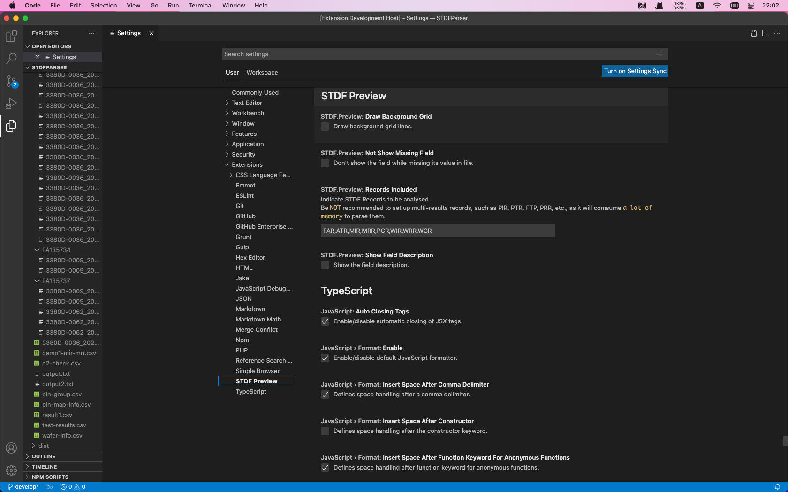

# vscode-stdf-preview

VSCode extension to preview STDF files.

## Features
- Preview profile context of STDF file

- Preview SoftBin P/F Map  of STDF file

- Preview any record detail of STDF file

## Usage
Right click on a STDF file (.std | .stdf) in explorer:
1. `Profile Preview` to view the profile context
2. `Map Preview` to view the SoftBin P/F Map
3. `Record Preview` to view any detail of STDF record

## Configuration

1. `STDF.Preview: Draw Background Grid`: use in `Map Preview`, set True to be shown the grid of SoftBin P/F Map, default is False
2. `STDF.Preview: Not Show Missing Field`: use in `Record Preview`, while True, the fields will NOT be shown if their values was missing in STDF file, default is False
3. `STDF.Preview: Records Included`: use in `Records Preview`, indicate the STDF Records to be analysed, default includes FAR,ATR,MIR,MRR,PCR,WIR,WRR,WCR
4. `STDF.Preview: Show Field Description`: use in `Recrod Preview`, set True to be shown the field description of STDF Recrods, default is False

## Notes
- please be patient, it takes about 5~6 seconds to show P/F Map on my MBP when the STDF file more than 90MB
- please be careful, it will comume a lot of memory to parse some multi-results records, such as PTR, FTR, PRR, etc.
